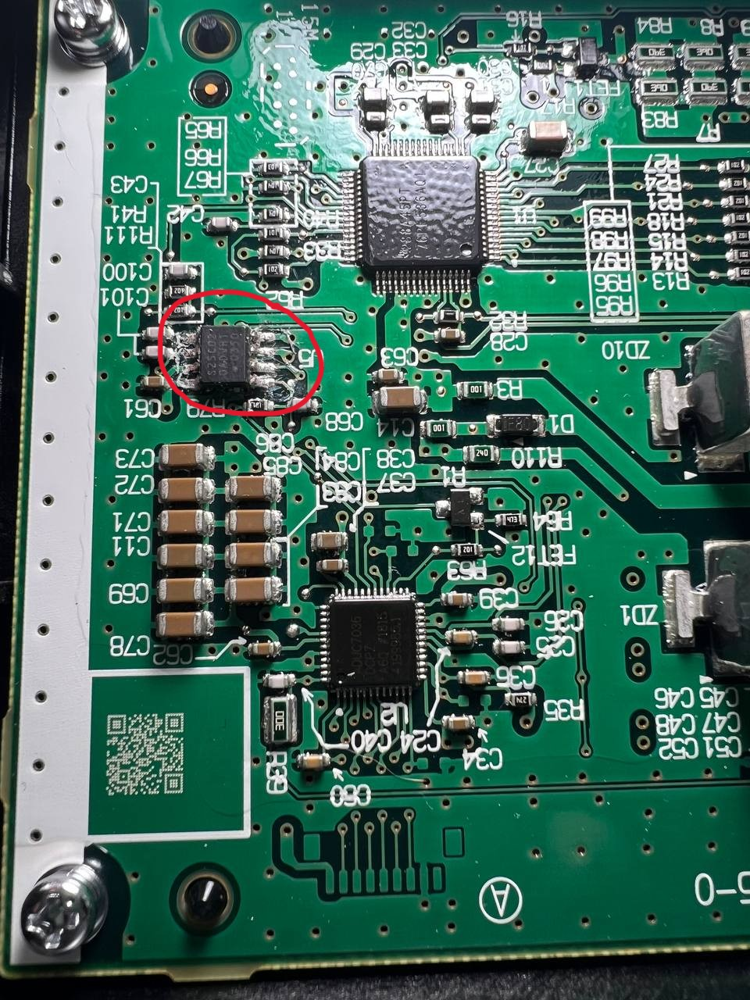

# Li-Ion Battery EEPROM Unlock Patcher

A C# tool for patching EEPROM dumps extracted from Li-Ion BMS (Battery Management System) boards to bypass protection modes and restore battery operation. 
Supports 128-byte and 256-byte I2C/SPI EEPROMs used in models like M5, M8, X3M, and X5M.

## 🔧 Purpose

This tool rewrites specific EEPROM bytes to:
- Reset internal lock/status flags
- Clear fault/error counters
- Simulate healthy battery state
- Unlock otherwise non-functional Li-Ion packs

## 🧠 Background

Many BMS-controlled Li-Ion batteries store protection flags and operational counters in onboard EEPROM (e.g., S-25C020A, S-25A010A). These flags trigger shutdown or lock conditions after specific thresholds or errors. By analyzing binary dumps before/after unlock events, we identified key addresses controlling this behavior.

## 💡 Features

- Supports **128-byte and 256-byte** EEPROMs
- Applies **model-specific byte patches** to restore normal battery state
- Simple command-line usage
- No external libraries or dependencies

## 🗂️ Patch Logic Overview

### 🔹 256-byte EEPROM (e.g., M3, M8, X3M, X5M)
Applies patch to known lock and fault control regions:

```csharp
new Dictionary<int, byte> {
    { 0x000C, 0x00 },  // Clear error/state
    { 0x0010, 0x62 },
    { 0x0013, 0xCB },
    { 0x0018, 0x32 },
    { 0x0020, 0x47 },
    { 0x0038, 0x00 },  // Reset usage counter
    { 0x005A, 0x30 },
    { 0x0066, 0x6F }, { 0x0068, 0x6F }, { 0x006A, 0x6F },
    { 0x006C, 0x97 }, { 0x006D, 0x5D },
    { 0x0078, 0x02 },  // Unlock flag
    { 0x008C, 0x47 },
    { 0x00F8, 0xFD }
}
```

### 🔹 128-byte EEPROM (e.g., M5, X5M)
Applies a similar reset logic adjusted for the shorter dump:

```csharp
new Dictionary<int, byte> {
    { 0x0000, 0x57 },
    { 0x0003, 0x29 },
    { 0x000C, 0x00 }, { 0x000D, 0x00 },
    { 0x0010, 0x54 }, { 0x0013, 0x8D },
    { 0x0014, 0x31 }, { 0x0018, 0x13 },
    { 0x0020, 0x09 }, { 0x0021, 0xE2 },
    { 0x0024, 0x00 }, { 0x0034, 0x00 },
    { 0x0038, 0x00 }, { 0x003C, 0x33 },
    { 0x0044, 0x00 }, { 0x005A, 0x00 },
    { 0x0066, 0xB6 }, { 0x0067, 0x51 },
    { 0x006C, 0xCC }, { 0x0078, 0x01 }
}
```

## 🚀 How to Use
1. Place your binary EEPROM dump as initial.bin in the same folder

2. Compile and run the project:
```bash
dotnet build
./liion_battery_patcher
```
3. The tool will output patched.bin, which you can write back to the EEPROM

## ⚠️ Disclaimer
This tool is for educational and diagnostic use only. 
Unlocking BMS-controlled batteries may void warranties or violate manufacturer safety protocols. 
Use responsibly and at your own risk.

## 📜 License
This project is licensed under the MIT License. See the LICENSE file for details.

## 🛠️ How To Extract EEPROM?
- **R/W**: Use the `XGecu T56 Universal Programmer (or other tool)` to extract and write the EEPROM dump.
- **TSSOP8 Clip**: Use the `TSSOP8 Test Clip` to connect to EEPROM. (clear the connection legs on EEPROM)
- 

## 🖼️ Share your EEPROM Dumps to comunity
- If you have a working EEPROM dump, please share it with the community.
- If you have a non-working EEPROM dump, please share it with the community.
- All dumps will be used to improve the patching process.